<div align="center">




</div>

---

## `> ABOUT_OPERATOR`

```yaml
operator:      Mustafa Rajih Ali Al-Ajwadi
role:          AI Engineer | Cybersecurity Specialist
founder_of:    Novus AI Dynamics
domains:       [ AI, Robotics, Cybersecurity, Autonomous Systems,
                 Smart Agriculture, Research ]
status:        Building next-generation intelligent & secure systems
```

I engineer at the intersection of **artificial intelligence**, **autonomous robotics**, and **cyber intelligence**. As founder of **Novus AI Dynamics**, I design AI-driven platforms spanning smart-agriculture drones, autonomous mapping UAVs, and security-technology research. My work blends applied machine learning, computer vision, and OSINT-driven intelligence analysis to deliver systems suited for research, industry, and mission-critical environments.

---

## `> CORE_EXPERTISE`

<div align="center">


</div>

---

## `> COMBAT_STATISTICS`

<div align="center">


</div>

---

## `> FEATURED_OPERATIONS`

### 🛰️ Novus AI Dynamics
AI research & product venture building intelligent, secure autonomous systems.
`AI` · `TypeScript` · `Robotics` · `R&D` → [novus-ai-dynamics-2.0](https://github.com/MustafaRajihAli/novus-ai-dynamics-2.0)

### 📐 AI Implementation Blueprints
Reference architectures and blueprints for deploying AI systems.
`AI` · `Architecture` · `MLOps` → [novus-ai-implementation-blueprints](https://github.com/MustafaRajihAli/novus-ai-implementation-blueprints)

### 🌾 Smart Agriculture Drone Platform
Precision-agriculture UAV platform using computer vision & sensor fusion for crop analytics.
`Computer Vision` · `UAV` · `IoT` · `Edge AI`

### 🗺️ Autonomous Mapping UAV
Self-navigating drone for terrain mapping & aerial intelligence.
`Autonomy` · `SLAM` · `ROS` · `Sensor Fusion`

### 🛡️ Cybersecurity Research
Defensive security tooling, threat analysis & security-technology research.
`Security` · `Threat Intel` · `Hardening`

### 🔎 Intelligence Analytics Tools
OSINT & analytics tooling for structured intelligence workflows.
`OSINT` · `Analytics` · `Data Fusion`

---

## `> RESEARCH_PUBLICATIONS`

```
[01] Intelligence Analysis    -- methodologies & analytic frameworks
[02] Cyber Intelligence       -- threat landscapes & defensive strategy
[03] Security Technologies    -- applied security systems research
[04] AI Applications          -- machine learning in real-world domains
[05] Robotics Research        -- autonomous systems & control
```

Selected research areas across intelligence, cybersecurity, AI, and robotics. Full publications available on request.

---

## `> TECHNOLOGY_STACK`

<div align="center">


</div>

---

## `> TRANSMISSION_QUOTE`

<div align="center">


</div>

---

## `> ESTABLISH_CONTACT`

<div align="center">

[](https://linkedin.com/in/mustafarajih)
[](https://novusaidynamics.com)
[](https://bisque-viper-167452.hostingersite.com/)
[](mailto:mustafarajih@gmail.com)
[](https://github.com/MustafaRajihAli)


</div>
